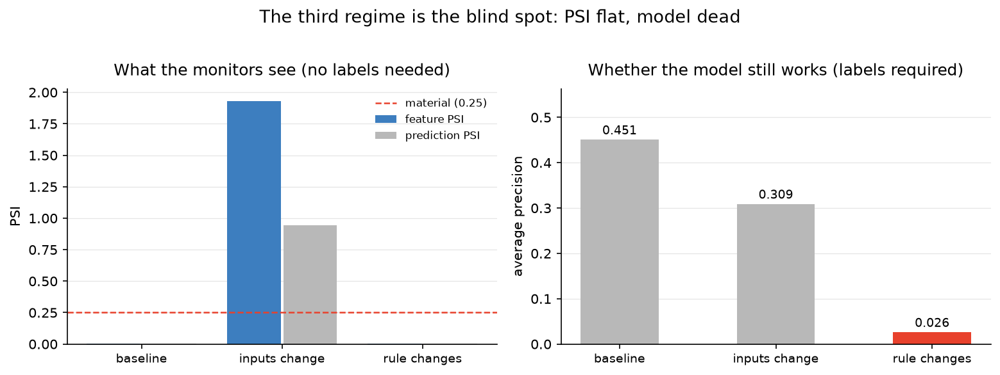

# drift-stream

[](https://github.com/kylekapoor/drift-stream/actions/workflows/tests.yml)

A fraud model works the day you ship it. Six months later it might not, and
nothing in the system will tell you.

This pipeline scores card transactions as they arrive, watches for the data
shifting under the model, and retrains when it does. It also shows one kind of
staleness that monitoring cannot find.

`Python` · `PyTorch` · `Apache Kafka` · `PostgreSQL` · `Docker` · `MLflow` · `scikit-learn` · `FastAPI`

---

## The result

Models go stale in two ways. I could only detect one of them.



In the "rule changes" regime the model has stopped working, average precision down
from 0.451 to 0.026, and every monitor that runs without labels still reports
"stable". When
fraudsters change tactics while the transactions look the same, identical inputs
pass through an identical model and produce identical outputs. There is no signal
to find. Only labels expose it, and card-fraud labels arrive weeks later with the
chargebacks, so you keep approving fraud for the length of that lag.

The middle regime is friendlier: when the inputs move, PSI hits **1.929** against
a 0.25 material threshold, straight away and with no labels.

## Latency

Tick-to-decision, producer timestamp to decision, broker included. Scoring runs
inside the consumer loop, not behind an HTTP call.

| Path | p50 | p99 |
|---|---|---|
| TorchScript | **10.9 µs** | 20.5 µs |
| sklearn `predict_proba` | 1,250 µs | 3,754 µs |
| end-to-end through Kafka | 2.12 ms | 44.5 ms |

TorchScript scores a row 115x faster, and most of sklearn's 1.25 ms goes to input
validation rather than arithmetic. The PyTorch model also scores better, 0.472
against 0.437 average precision.

## Design

```
Generator ──> Kafka ──> consumer: score inline ──> decision
                            │                          │
                            │                          └─> Postgres (batched)
                            ├─ every N events: PSI + KS + windowed accuracy
                            └─ trigger ──> retrain (worker thread) ──> MLflow ──> hot swap
```

Postgres stores every decision, so afterwards I query instead of grepping logs:
precision by model version, which features drifted before a retrain fired, what a
disputed transaction scored. Writes batch in blocks of 500, because one insert per
event drops a network round trip into a loop measured in microseconds.

Two triggers cover the two failure modes. **input-drift** fires on material PSI
without labels. **performance-decay** needs labels and is the only one that
catches a changed rule.

I wrote PSI by hand because two details decide whether it works and neither shows
up in a library call. Bin edges must come from the reference window and stay
frozen, since re-binning on the current window compares a distribution against
itself and pushes PSI toward zero exactly when you need it. Empty bins need
clamping or the logarithm returns infinity.

## Bugs worth keeping

Each of these produced believable output while being wrong.

- **4 partitions.** Kafka orders messages inside a partition and not across them,
  so pre-drift and post-drift data interleaved and every analysis window held a
  mix of both.
- **Retraining fed itself.** After a swap, prediction PSI still compared against
  the old model's scores, so it measured the swap, retrained, and repeated.
  Re-baselining fixed it, then left the same bug in a window of two statements:
  the consumer closes windows on its own thread, so one landing between the swap
  and the re-baseline scored the new model against the old baseline. The
  assignment now happens first.
- **A dead database killed the pipeline.** `connect` treats a missing Postgres
  as "run without one", but `flush` raised, so a restart mid-run propagated out
  of the scoring loop. It now drops the batch, counts it, and disables itself.

## Usage

```bash
docker compose run --rm pipeline python run.py train
docker compose run --rm pipeline python run.py demo --regime covariate_shift
docker compose --profile api up          # scoring API on :8000
```

Compose starts Kafka 4.x in KRaft mode, Postgres and the pipeline. The broker
advertises two listeners, `kafka:9092` for containers and `localhost:29092` for
the host; advertise one and the other side breaks silently.

Without Docker, `run.py drift` produces the headline table with no Kafka at all,
and `test_stream.py` runs 30 checks.

## Limits

- Labels arrive with the event here. Real ones lag by weeks, so the trigger that
  catches a changed rule would fire long after the money was gone.
- The data is synthetic. I know the generating process, which keeps the
  experiment clean and also means the model never meets real mess.
